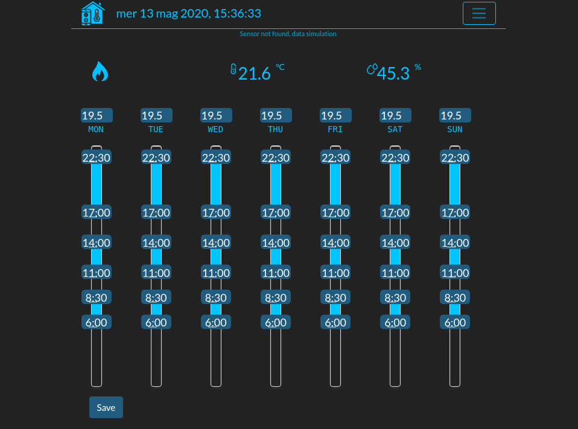
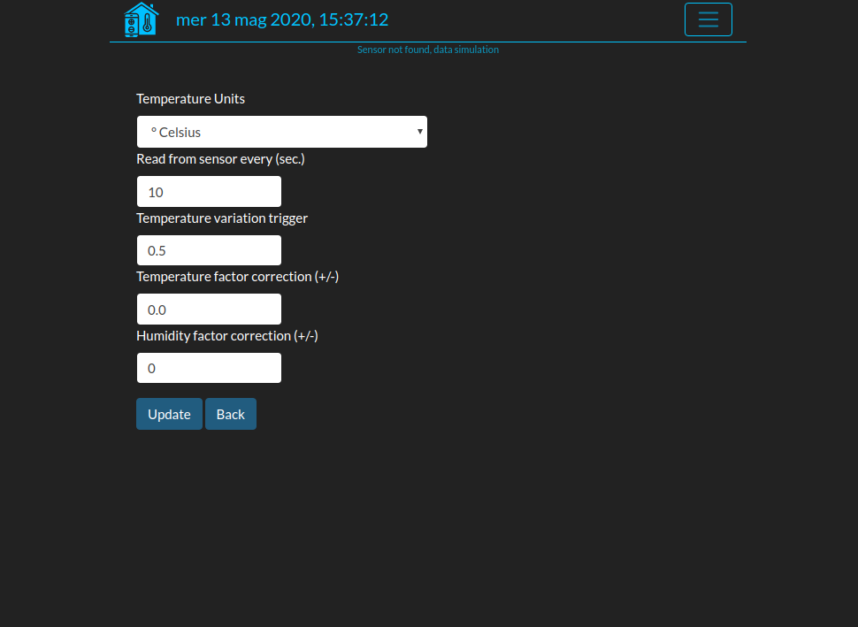
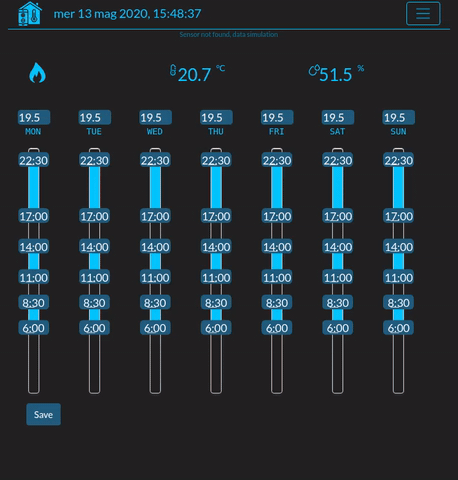
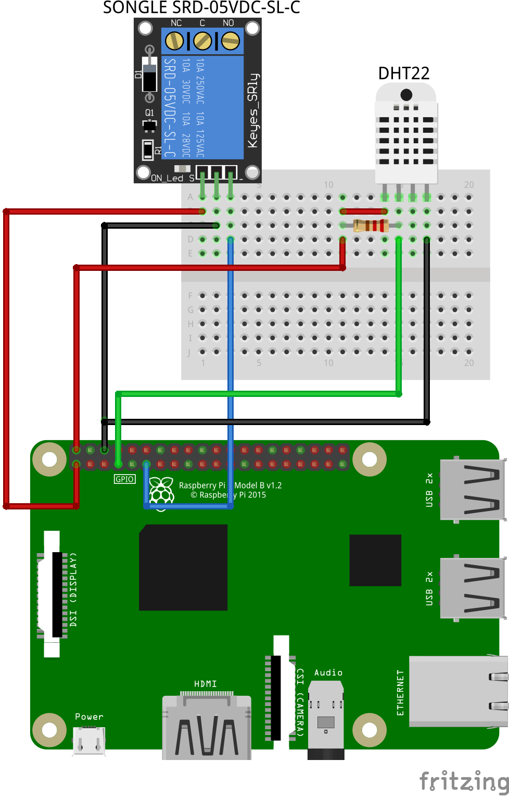

# ThermoHome Pi
Simple flask webapp Thermostat running on [Raspberry Pi](https://www.raspberrypi.org/) 

Home thermostat with weekly scheduling.



Get sensor values (temperature and humidity) every "n" seconds (due to Settings section).





Values are sending (websocket) to client according to delta value from
previous one (minimum delta value to trigger is specified in Setting section).

## Getting Started

### Prerequisites
DHT22 hardware and Relay (Songle SRD-05DC-SL-C) connected to Raspberry Pi or, if not, a "demo mode" starts automatically.



### Installing

From project root create virtual environment, activate it and install requirements:

```sh
~/ThermoHome_pi$ python3 -m venv venv
~/ThermoHome_pi$ source venv/bin/activate
~/ThermoHome_pi$ pip install -r requirements.txt
~/ThermoHome_pi$ python3 init-db.py
```

## Running

__as app__

```sh
export FLASK_APP=flaskr
flask run
```

__as wsgi server__

```sh
gunicorn --worker-class eventlet -w 1 -b localhost:8080 wsgi
```

## Deployment

As seen above, as any wsgi app.

## Authors 

Franco Parodi <franco.parodi@aol.com>

## License

This project is licensed under the MIT License.
